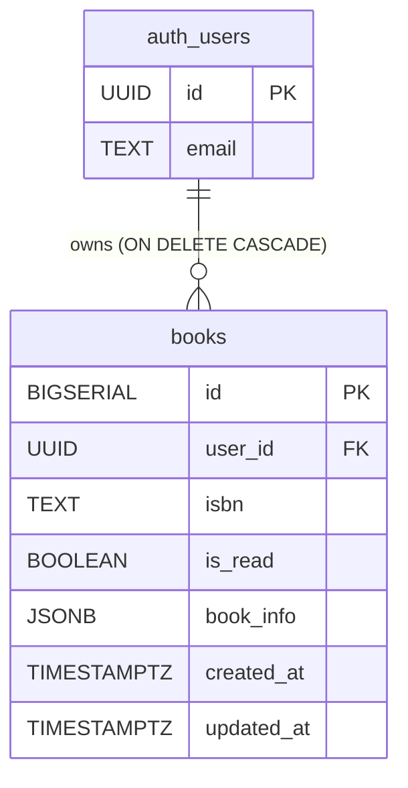

# DB設計ドキュメント

## ER図



---

## テーブル定義

### `public.books`

ユーザーの蔵書を管理するテーブル。各レコードは「あるユーザーが登録した一冊の本」を表す。

| カラム | 型 | NULL | デフォルト | 説明 |
|---|---|---|---|---|
| `id` | BIGSERIAL | NOT NULL | 自動採番 | サロゲートキー |
| `user_id` | UUID | NOT NULL | — | 登録したユーザー（`auth.users.id` 参照） |
| `isbn` | TEXT | NOT NULL | — | ISBN-10 または ISBN-13 |
| `is_read` | BOOLEAN | NOT NULL | FALSE | 読了フラグ（true=既読） |
| `book_info` | JSONB | NOT NULL | `{}` | 国立国会図書館 API から取得した書誌情報 |
| `created_at` | TIMESTAMPTZ | NOT NULL | NOW() | レコード作成日時 |
| `updated_at` | TIMESTAMPTZ | NOT NULL | NOW() | レコード更新日時（トリガーで自動更新） |

#### 制約

| 制約名 | 種別 | 内容 |
|---|---|---|
| `books_isbn_format` | CHECK | ISBN-10（`\d{9}[\dX]`）または ISBN-13（`\d{13}`）形式のみ許可 |

> **同一 ISBN の重複登録について**: 同じ本を複数冊所持するケースがあるため、`(user_id, isbn)` の UNIQUE 制約は設けない。重複時の制御はアプリケーション側で行う（登録前に同一 ISBN が存在する場合は「すでに登録済みですが、もう1冊追加しますか？」と確認する）。

#### カラム設計の理由

**`user_id`**
蔵書はユーザーのプライベートデータ。所有者を明示することで RLS による行レベル制御が可能になる。`auth.users` へ外部キーを張ることで参照整合性を保ち、ユーザー削除時は `ON DELETE CASCADE` で蔵書も自動削除される。

**`isbn`**
国立国会図書館 API の検索キーとして使用する。書誌情報（タイトル・著者・出版社など）はこの API から動的に取得するため、API の入力値として専用カラムを用意している。

**`is_read`**
「読んだかどうか」はユーザーが管理するビジネスデータであり、外部 API とは独立している。BOOLEAN 型で意味を明確にし、DEFAULT FALSE（未読）とする。

**`book_info`**
国立国会図書館 API のレスポンスをそのまま格納する JSONB カラム。API のレスポンス構造が変わっても DDL 変更不要で対応できる。タイトル・著者・出版社・発行年・サムネイル URL などを含む想定。

---

## インデックス

| インデックス名 | カラム | 目的 |
|---|---|---|
| `books_user_id_idx` | `user_id` | RLS ポリシーの評価を高速化（必須） |

---

## Supabase Auth との連携設計

### 認証フロー概要

```
クライアント（Web）               Supabase Auth          Go API (Echo)           PostgreSQL
      │                               │                      │                      │
      │── ログイン（email/password）─►│                      │                      │
      │◄─ JWT アクセストークン ────────│                      │                      │
      │                               │                      │                      │
      │── API リクエスト ──────────────────────────────────►│                      │
      │   Authorization: Bearer <JWT> │                      │                      │
      │                               │     JWT 検証          │                      │
      │                               │◄─────────────────────│                      │
      │                               │──── 検証結果 ────────►│                      │
      │                               │                      │── クエリ実行 ────────►│
      │                               │                      │   (user_id を使用)   │
      │                               │                      │◄─ 結果（自分の行のみ）─│
      │◄─ レスポンス ──────────────────────────────────────────│                      │
```

### 認可の多層防御

このシステムは「アプリケーション層」と「データベース層」の二重で認可を行う。

#### 層1: アプリケーション層（Go/Echo ミドルウェア）

Echo のミドルウェアで JWT を検証し、無効なトークンは弾く。

```go
// JWT ミドルウェアの設定例（echojwt または手動検証）
// Supabase の JWT_SECRET（Supabase ダッシュボード > Settings > API から取得）を使って検証する
e.Use(middleware.JWTWithConfig(middleware.JWTConfig{
    SigningKey: []byte(os.Getenv("SUPABASE_JWT_SECRET")),
}))
```

JWT の `sub` クレームが `auth.users.id`（UUID）に対応する。

```go
// ハンドラー内での user_id 取得
token := c.Get("user").(*jwt.Token)
claims := token.Claims.(jwt.MapClaims)
userID := claims["sub"].(string)
```

#### 層2: データベース層（Row Level Security）

RLS により、たとえアプリケーションのバグで誤った SQL が発行されても、データベース側で行レベルのアクセス制御が保証される。

**Supabase の `auth.uid()` を使う方式（推奨）**

Supabase の pgx ドライバーを利用する場合、JWT をセッション変数として渡すと `auth.uid()` が自動的に解決される。

```go
// pgx で接続後、リクエストごとに JWT をセット
conn.Exec(ctx, "SELECT set_config('request.jwt.claims', $1, true)", jwtString)
```

これにより RLS ポリシーの `auth.uid()` が JWT の `sub` を返すようになる。

**アプリケーション側で user_id を WHERE に渡す方式（シンプル）**

JWT のセッション設定が難しい場合、アプリケーション側で抽出した `userID` を明示的に WHERE 句に渡す。RLS は保険として機能する。

```sql
-- アプリケーションがこのクエリを実行（userID はミドルウェアで取得済み）
SELECT * FROM public.books WHERE user_id = $1;
```

この場合も RLS が有効なため、`$1` に他のユーザー ID を渡しても行は返らない。

### 環境変数

| 変数名 | 値の取得場所 | 用途 |
|---|---|---|
| `SUPABASE_JWT_SECRET` | Supabase ダッシュボード > Settings > API > JWT Secret | JWT 署名検証 |
| `DATABASE_URL` | Supabase ダッシュボード > Settings > Database > Connection string | DB 接続 |

### RLS ポリシー一覧

| ポリシー名 | 操作 | 条件 |
|---|---|---|
| `books_select` | SELECT | `auth.uid() = user_id` |
| `books_insert` | INSERT | `auth.uid() = user_id` |
| `books_update` | UPDATE | `auth.uid() = user_id` |
| `books_delete` | DELETE | `auth.uid() = user_id` |

> **パフォーマンス注意点**: RLS ポリシーでは `auth.uid()` を `(SELECT auth.uid())` でラップしている。これにより関数がリクエストごとに一度だけ評価され、全行評価を防ぐ。`user_id` カラムにインデックスも必須。

### `FORCE ROW LEVEL SECURITY` について

テーブルオーナー（postgres ロール）からのクエリにも RLS を強制適用する設定。サービスロールキーを使う Supabase Admin 操作など、意図的に RLS を bypass したい場合は `service_role` で接続することで回避できる（バックエンドの管理用途に限定すること）。
